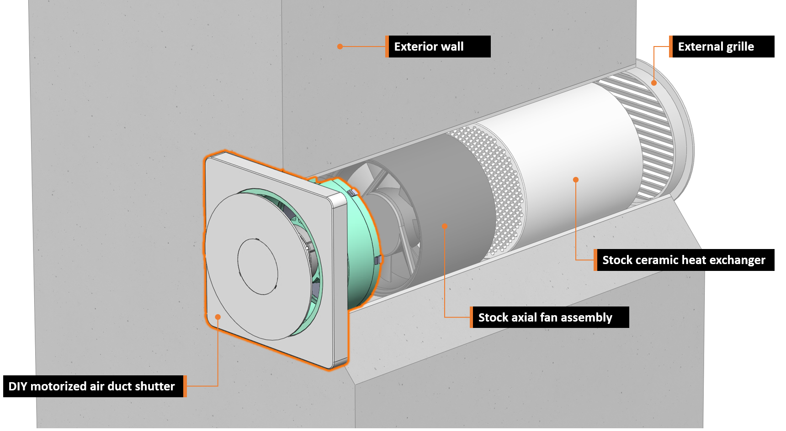

# AutoDuct: smart motorized air duct shutter

AutoDuct is a smart DIY air duct shutter for decentralized ventilation systems in residential buildings. Its main purpose is to automatically control airflow and block outside noise using a 3D-printed shutter system. This solves the problem of unintended air flow into the apartment during cold and windy days to increase comfort, maintain energy efficiency and reduce expenses for heating.
The integrated electronics of the air duct shutter assembly also gives full control of the ventilation system’s fan to enable features like flexible ventilation schedules and automatic humidity control. The Bluetooth low energy interface lets you control and configure the system via a mobile app. Multiple ventilation units can also be integrated into Apple HomeKit via a simple ESP32-powered BLE-to-Wifi-bridge.

# Mechanical Assembly

At the heart of this device is a mostly 3D-printed linear actuator which is used to open and close a shutter disc to prevent unwanted airflow. The 3D-printed leadscrew of the actuator is directly attached to a small brushed DC motor with an integrated gearbox.

Integrated into the encapsulated actuator unit two hall effect switches on a separate ring-shaped PCB are used to detect the end stop positions (open/close) of the shutter mechanism in combination with tiny magnets. The axial position of these magnets can be adjusted to compensate for mechanical tolerances in the assembly.

Note: the actuator unit does not use any additional (ball) bearings to keep the BOM simple and material cost low. Axial and radial forces are solely absorbed by the 3D-printed linear guides and the integrated bearings of the geared motor. This could potentially reduce longevity of the assembly but has not been an issue while testing multiple units over more than a year now. Use of silicone grease is highly recommended.

# Electronics

The electronics are based around a Microchip 32-bit microcontroller (PIC32MX), which might be a little bit overpowered for this project but was available from a previous project and has a neat footprint. The +3V3 rail is generated from the +12V bus by a step-down converter. The geared DC motor is driven by a dedicated H-bridge driver IC (DRV8801).

Behind the front cover of the assembly another small PCB is hidden. This PCB contains the Bluetooth low energy module (HM-17), a serial EEPROM, a real time clock (RTC) IC and a humidity and temperature sensor. User feedback is given via a white LED which shines through the 3D-printed enclosure and has brightness control via PWM.

# Firmware

The main processor of the device (PIC32MX150F128B) runs a super simple multitasking OS which takes care of these main tasks:

* monitoring of fan control PWM signal from the stock ventilation system control bus
* reading of temperature / humidity from SHT31 sensor
* generating the PWM control signal for connected fan
* motor control including end stop detection
* handle the BLE communication when the system is connected to the mobile app 

Depending on the selected operating mode, the device will perform the following actions:

* opening / closing the valve based on the detected fan control PWM signal
* automatically activating the fan based on schedule events or humidity thresholds
* react to remote control commands issued via the mobile app / BLE connection 

A custom bootloader was developed which enables over-the-air firmware updates via the Bluetooth low energy interface. 

# Project Video

